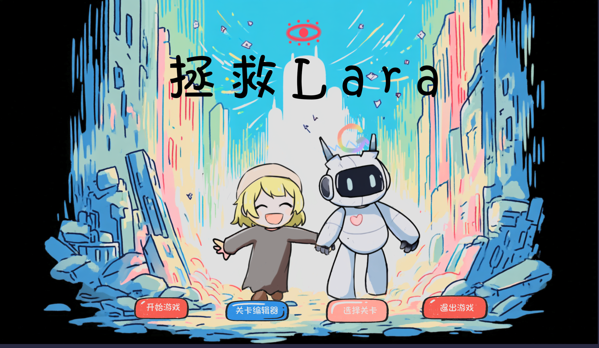

## 项目简介

《Save Lara》是一款在 Game Jam 期间制作的回合制策略解谜原型。玩家操控机器人 Alice，推动装有 Lara 的箱子穿过机器人的巡逻与追击，将她送到关卡终点。

作品把经典推箱子放进一个会响应玩家行动的敌人系统中：玩家每走一步，敌人也会行动；箱子、按钮、升降桩和敌人的视野共同决定路线。玩家需要规划的不只是“箱子应该往哪里推”，还包括每一回合应该让哪些对象处于什么状态。

## 我的作用

项目共 5 人，我负责程序开发，同时参与部分美术和关卡制作。美术部分是一次尝试，并不是这个项目主要展示的能力；我希望通过它展示的是玩法机制、系统实现和关卡设计。

在团队共同搭建的 Godot 项目基础上，我的工作主要包括：

- 提出并参与实现“重启 / 复原”核心机制：玩家位置保持不变，敌人的追击状态和部分机关状态可以被恢复；
- 为回合制流程加入步数上限、步数消耗和步数耗尽判定，并让撤销、普通重置与重启技能同步恢复步数和对象状态；
- 修正重启后的升降桩恢复逻辑：如果按钮上仍有物体，升降桩保持可通行，避免机关状态与场面不一致；
- 参与处理箱子是否到达目标、网格占用和视觉状态的恢复，减少撤销或重启后逻辑状态与画面状态不同步的问题；
- 配置不同视野和移动步数的敌人变体，并增加敌人巡逻 / 追击方向提示；
- 制作和迭代多组机关与关卡，调整关卡顺序、步数上限、剧情提示和敌人配置；
- 参与 UI、主菜单、部分角色与场景素材，以及音效和 BGM 的接入。

项目使用 Godot，间断开发约 3 周。

## 核心机制：重启不是撤销

重启技能并不是把玩家倒退到上一个位置，而是只改变环境和敌人的状态：玩家可以保持当前位置，让敌人失去当前目标、恢复巡逻状态，并重置符合条件的升降桩。

这使重启成为一种主动安排战局的手段。玩家可以先推动箱子、触发机关或改变敌人的行动状态，再在原地重启，让下一回合从一个新的局面开始。升降桩和按钮又会根据按钮上是否有物体决定最终状态，因此“重启”并不总是简单地恢复成同一个结果。

规则 PDF 中对这套机制的描述也强调了两个关键限制：敌人有巡逻与追击两种状态，升降桩有普通开启和持续按压两种模式。两者叠加后，玩家需要把敌人视野、移动步数、箱子位置和机关状态放在同一个回合计划中考虑。

*项目主菜单。作品集中的重点是重启机制及其带来的关卡解法，而不是美术完成度。*

## 项目状态与体验

这是一个偏原型性质的 Game Jam 作品，整体呈现和美术完成度比较粗糙，核心目标是验证重启机制能否支撑一组有变化的推箱子关卡。

- [在 itch.io 体验网页版](https://ventsdenye2.itch.io/savelara)
- [查看项目源码](https://github.com/rorschachandbat/2025BUAAGJ)

网页版由于兼容性问题暂时没有声音。

## 技术关键词

Godot / 回合制解谜 / 推箱子 / 敌人巡逻与追击 / 机关状态 / 状态恢复 / 关卡设计 / Game Jam
